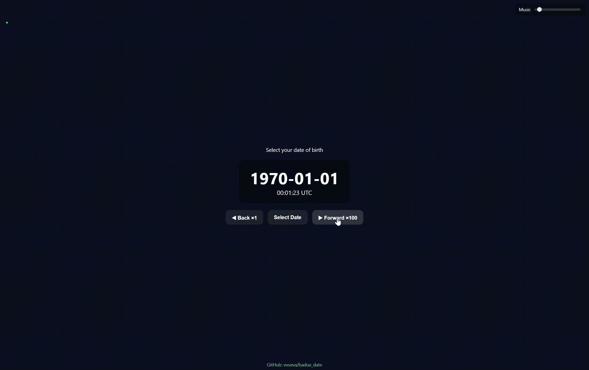

# badux_date

A GPT-5 generated slop.

A tiny Svelte + Vite + D3 demo. The time advances in real-time.
You can wait till it displays the desired date and enjoy the music.
Fast forwarding and going back in time is in beta.

## Run locally

0. Git clone.
1. Install deps
	npm install
2. Development server
	npm run dev
3. Production build
	npm run build
4. Preview built app
	npm run preview

